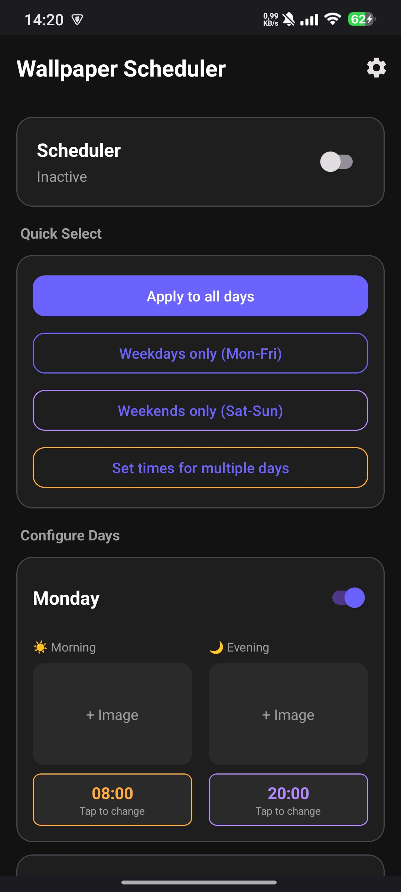
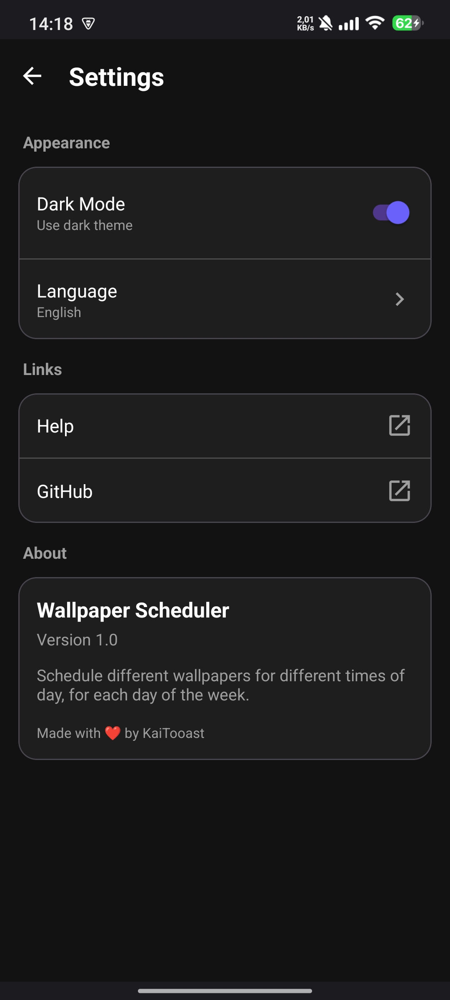

# Wallpaper Scheduler

<p align="center">
  
</p>

<p align="center">
  <strong>Schedule different wallpapers for different times of day</strong>
</p>

<p align="center">
  <a href="https://github.com/Michikaitsu/wallpaper-schedule/releases">
    
  </a>
  <a href="LICENSE">
    
  </a>
</p>

---

## Features

- 🌅 **Morning & Evening Wallpapers** - Set different wallpapers for day and night
- 📅 **Per-Day Configuration** - Customize wallpapers for each day of the week
- ⏰ **Flexible Scheduling** - Set exact times (with minutes) for wallpaper changes
- 🎨 **Modern UI** - Clean Material Design 3 interface
- 🌙 **Dark & Light Mode** - Choose your preferred theme
- 🌍 **Multi-Language** - English and German supported
- 📱 **Background Service** - Wallpapers change automatically, even after reboot

## Screenshots

<p align="center">
  
  
</p>

## Download

Download the latest APK from the [Releases](https://github.com/Michikaitsu/wallpaper-schedule/releases) page.

## Installation

1. Download the APK file from [Releases](https://github.com/Michikaitsu/wallpaper-schedule/releases)
2. Enable "Install from unknown sources" in your Android settings
3. Open the APK and install
4. Grant the required permissions (Storage, Wallpaper)

> ⚠️ **Note:** Google Play Protect may show a warning because the app is not from the Play Store. This is normal for all sideloaded apps. Simply tap "Install anyway" to continue.

## Usage

1. **Select wallpapers** - Tap on the morning (☀️) or evening (🌙) image slots
2. **Set times** - Tap on the time buttons to change when wallpapers switch
3. **Enable scheduler** - Toggle the main switch to activate
4. **Quick setup** - Use the quick select buttons to apply wallpapers to multiple days

## Building from Source

### Requirements
- Android Studio or Gradle
- JDK 17+
- Android SDK 34

### Build Commands

```bash
# Debug build
./gradlew assembleDebug

# Release build (requires signing)
./gradlew assembleRelease

# Install on connected device
./gradlew installDebug
```

## Permissions

- `SET_WALLPAPER` - Required to change wallpapers
- `READ_MEDIA_IMAGES` / `READ_EXTERNAL_STORAGE` - Required to access your photos
- `RECEIVE_BOOT_COMPLETED` - To restore scheduler after device restart
- `FOREGROUND_SERVICE` - To run the scheduling service

## Contributing

Contributions are welcome! Please feel free to submit a Pull Request.

## License

This project is licensed under the MIT License - see the [LICENSE](LICENSE) file for details.

## Author

Made with ❤️ by [Michikaitsu](https://github.com/Michikaitsu)
